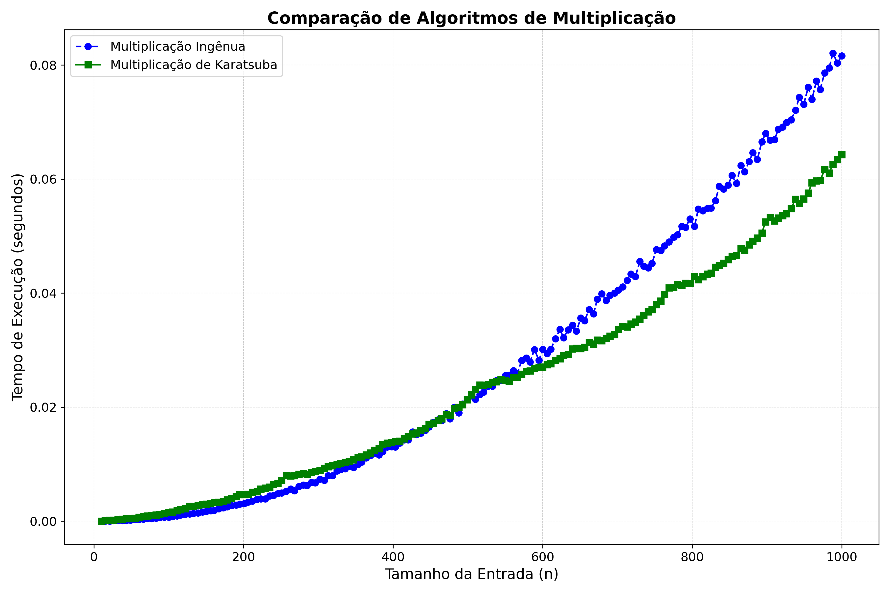
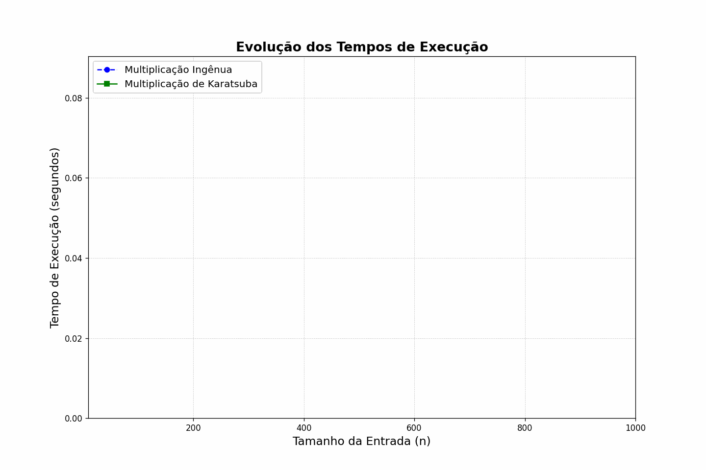

# PROJETO 1: Algoritmo de Karatsuba vs. Multiplicação Ingênua

Este repositório contém a implementação, análise e documentação comparativa entre o **algoritmo de multiplicação ingênua** e o **algoritmo de Karatsuba**. O objetivo é explorar as diferenças em termos de complexidade computacional.

---

## 📋 Descrição

A multiplicação de inteiros grandes é uma operação fundamental em diversas áreas da ciência da computação, como em criptografia, álgebra computacional e análise numérica. Quando lidamos com números de grande tamanho, a eficiência dos algoritmos de multiplicação se torna crucial para o desempenho de sistemas que dependem de operações matemáticas em larga escala.

Neste projeto, comparamos duas abordagens principais para a multiplicação de inteiros grandes:

1. **Multiplicação Ingênua**: 
   - A abordagem ingênua realiza a multiplicação de dois números grandes, representados como vetores de dígitos, de forma direta. O algoritmo percorre todos os pares de elementos dos vetores e soma os produtos parciais. 
   - **Complexidade Temporal**: $O(n^2)$. Embora simples de implementar, sua eficiência diminui rapidamente à medida que o tamanho dos números aumenta.

2. **Algoritmo de Karatsuba**: 
   - O algoritmo de Karatsuba utiliza uma técnica de divisão e conquista para reduzir o número de multiplicações necessárias. O número grande é dividido em duas metades e, em vez de realizar multiplicações diretas, combina resultados parciais de forma inteligente, o que reduz a complexidade.
   - **Complexidade Temporal**: $O(n^{\log_2 3})$, o que oferece uma melhoria significativa em relação à abordagem ingênua, especialmente para números grandes.

As implementações dos dois algoritmos foram realizadas em Python, utilizando listas para representar os números de precisão arbitrária. Para garantir uma comparação justa, ambos os algoritmos foram avaliados com o mesmo conjunto de entradas aleatórias de diferentes tamanhos. 

A performance de ambos os algoritmos foi analisada em termos de tempo de execução para uma série de tamanhos de entrada, variando de números pequenos a muito grandes. Os resultados foram visualizados por meio de gráficos comparativos, com destaque para o comportamento assintótico das duas abordagens. 

---

## 🚀 Tecnologias Utilizadas

- **Python 3.9**: Linguagem de programação utilizada para implementar os algoritmos de multiplicação e gerar os gráficos.
- **Matplotlib**: Biblioteca usada para criar os gráficos comparativos e a animação dos tempos de execução.
- **NumPy**: Biblioteca utilizada para operações numéricas e manipulação de vetores.
- **LaTeX**: Ferramenta utilizada para a elaboração do relatório técnico.
- **ImagemMagick**: Utilizado para gerar o GIF animado da evolução dos tempos de execução.

---

## 📁 Funcionalidades

- **Cálculo de Tempos de Execução**: O código executa ambos os algoritmos em diferentes tamanhos de entrada, gerando tempos de execução para cada um.
- **Gráficos Comparativos**: Geração de gráficos que comparam o tempo de execução dos dois algoritmos com base no tamanho da entrada.
- **Animação da Evolução dos Tempos**: Um GIF é gerado para mostrar a evolução dos tempos de execução ao longo do aumento do tamanho das entradas.

---

## 📊 Resultados

Os gráficos a seguir ilustram os principais resultados:

### Crescimento Assintótico

### Visualização Interativa

O GIF demonstra a evolução dos tempos de execução à medida que o tamanho da entrada aumenta.
